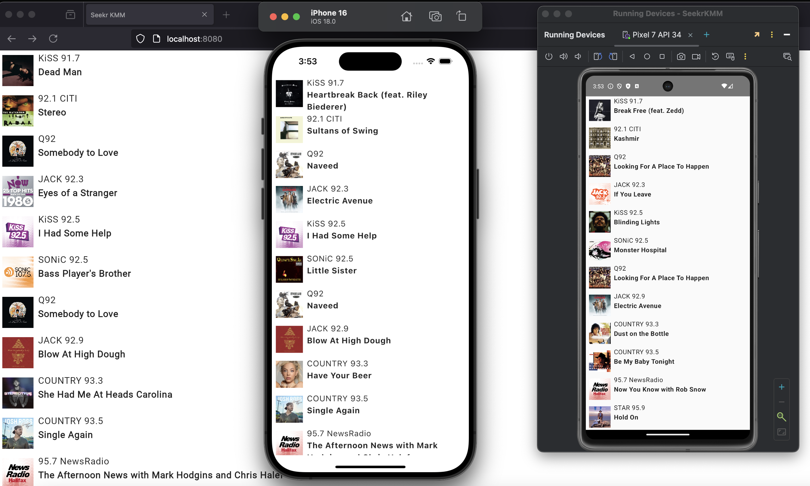

This is a Kotlin Multiplatform project targeting Android, iOS, Web.

Calls 2 separate APIs and combines the data into a single UI rendered on all platforms (Android, iOS, Web)

* `/composeApp` is for code that will be shared across your Compose Multiplatform applications.
  It contains several subfolders:
  - `commonMain` is for code that’s common for all targets.
  - Other folders are for Kotlin code that will be compiled for only the platform indicated in the folder name.
    For example, if you want to use Apple’s CoreCrypto for the iOS part of your Kotlin app,
    `iosMain` would be the right folder for such calls.

* `/iosApp` contains iOS applications. Even if you’re sharing your UI with Compose Multiplatform, 
  you need this entry point for your iOS app. This is also where you should add SwiftUI code for your project.

Generate the client by running
1. `content-api-codegen`
2. `live-api-codegen`
3. `codegen-fix` (codegen did not play well with ktor)

Open the web application by running the `wasm-js-browser-run` Gradle task.
Open the Android application by running the `composeApp` Gradle task.
Open the iOS app by building this project and then opening the Xcode project in the `iosApp` directory.

